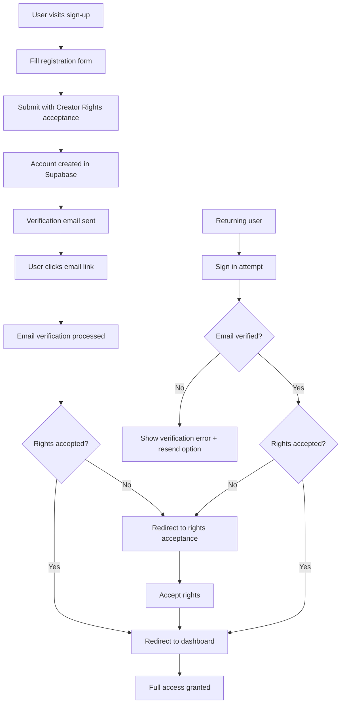

# 🔐 COMPLETE EMAIL VERIFICATION & AUTHENTICATION SYSTEM

## **📋 SYSTEM OVERVIEW**

This comprehensive authentication system handles the complete user journey from registration through email verification to authenticated access, with robust error handling and security measures.

### **🔄 User Journey Flow**



---

## **🛠️ IMPLEMENTATION COMPONENTS**

### **1. Database Schema**
- ✅ **Creator Rights Acceptance Table** (`creator_rights_acceptances`)
- ✅ **User Profiles with Verification Status**
- ✅ **Row Level Security (RLS) Policies**

### **2. Authentication Logic**
- ✅ **Enhanced Verification State Management** (`lib/auth/verification.ts`)
- ✅ **Security & Rate Limiting** (`lib/auth/security.ts`)
- ✅ **Sign-in with Verification Checks**
- ✅ **Email Verification Processing**

### **3. User Interface Components**
- ✅ **Enhanced Login Form** with verification status feedback
- ✅ **Registration Form** with rights acceptance
- ✅ **Verification Success Page** with dynamic routing
- ✅ **Error Handling Pages** with recovery options

### **4. API Endpoints**
- ✅ **Email Verification Handler** (`/auth/confirm`)
- ✅ **Rights Acceptance API** (`/api/rights/accept`)
- ✅ **Middleware Authentication** with verification checks

---

## **🔒 SECURITY FEATURES**

### **Rate Limiting**
- **Sign-in**: 5 attempts per 15 minutes per IP
- **Sign-up**: 3 attempts per hour per IP
- **Email Resend**: 3 attempts per 5 minutes per IP
- **Password Reset**: 3 attempts per hour per IP

### **Input Validation**
- Email format validation with temporary email blocking
- Password strength requirements (8+ chars, mixed case, numbers, symbols)
- Full name sanitization and validation
- XSS prevention through input sanitization

### **Security Monitoring**
- Failed login attempt logging
- Rate limit violation tracking
- Suspicious activity detection
- Security event fingerprinting

---

## **🧪 TESTING PROCEDURES**

### **Test Environment Setup**

1. **Local Development Testing**
```bash
# Start development server
npm run dev

# Verify Supabase connection
npm run check:env

# Run authentication tests
npm run test -- auth
```

2. **Email Configuration Testing**
```bash
# Test email delivery (requires Supabase project setup)
curl -X POST "https://your-project.supabase.co/auth/v1/signup" \
  -H "Content-Type: application/json" \
  -H "apikey: YOUR_ANON_KEY" \
  -d '{"email": "test@example.com", "password": "TestPass123!"}'
```

### **Comprehensive Test Scenarios**

#### **🔸 Scenario 1: New User Registration**

**Test Steps:**
1. Navigate to `/auth/sign-up`
2. Fill out registration form:
   - Full Name: "Test User"
   - Email: "test@yourdomain.com"
   - Password: "SecurePass123!"
   - Confirm Password: "SecurePass123!"
   - ✅ Accept Creator's Bill of Rights
3. Submit form

**Expected Results:**
- ✅ Account created in Supabase
- ✅ Verification email sent
- ✅ User redirected to success page with email confirmation message
- ✅ Rights acceptance recorded in database

**Verification Steps:**
```sql
-- Check user creation
SELECT id, email, email_confirmed_at, created_at
FROM auth.users
WHERE email = 'test@yourdomain.com';

-- Check rights acceptance
SELECT user_id, version, accepted_at
FROM public.creator_rights_acceptances
WHERE user_id = 'USER_ID_FROM_ABOVE';
```

#### **🔸 Scenario 2: Email Verification Process**

**Test Steps:**
1. Receive verification email
2. Click verification link
3. Process verification

**Expected Results:**
- ✅ Email verified (`email_confirmed_at` populated)
- ✅ User redirected to appropriate page based on rights status
- ✅ Session established

**Test Commands:**
```bash
# Simulate email verification
curl "http://localhost:3000/auth/confirm?code=VERIFICATION_CODE"

# Check verification status
npm run test:auth -- --grep "email verification"
```

#### **🔸 Scenario 3: Sign-in Verification Checks**

**Test Steps:**
1. Navigate to `/auth/login`
2. Enter credentials for verified user
3. Submit login form

**Expected Results:**
- ✅ Authentication successful
- ✅ Verification status checked
- ✅ Appropriate redirect based on rights acceptance
- ✅ Dashboard access granted

**Edge Case Testing:**
```typescript
// Test unverified user sign-in
await signInWithVerification('unverified@test.com', 'password');
// Expected: Error with verification instructions

// Test verified user without rights
await signInWithVerification('verified-no-rights@test.com', 'password');
// Expected: Redirect to rights acceptance

// Test fully verified user
await signInWithVerification('verified-with-rights@test.com', 'password');
// Expected: Direct dashboard access
```

#### **🔸 Scenario 4: Error Handling & Recovery**

**Test Cases:**

1. **Invalid Credentials**
```typescript
await signInWithVerification('test@test.com', 'wrongpassword');
// Expected: Clear error message with recovery options
```

2. **Unverified Email**
```typescript
await signInWithVerification('unverified@test.com', 'correctpassword');
// Expected: Verification required message + resend option
```

3. **Expired Verification Link**
```bash
# Test with old verification code
curl "http://localhost:3000/auth/confirm?code=EXPIRED_CODE"
# Expected: Expiration error with resend option
```

4. **Rate Limiting**
```bash
# Test rate limiting (run 6 times quickly)
for i in {1..6}; do
  curl -X POST "http://localhost:3000/api/auth/signin" \
    -H "Content-Type: application/json" \
    -d '{"email": "test@test.com", "password": "wrong"}'
done
# Expected: Rate limit error after 5 attempts
```

#### **🔸 Scenario 5: Rights Acceptance Flow**

**Test Steps:**
1. User with verified email but no rights acceptance
2. Attempt to access dashboard
3. Redirect to rights acceptance page
4. Accept rights
5. Verify full access

**Expected Results:**
- ✅ Automatic redirect to rights acceptance
- ✅ Rights acceptance recorded
- ✅ Dashboard access granted after acceptance

---

## **📧 EMAIL TEMPLATES**

### **Verification Email Template (Supabase)**

```html
<!DOCTYPE html>
<html>
<head>
    <meta charset="utf-8">
    <title>Verify Your Manthan Account</title>
</head>
<body style="font-family: Arial, sans-serif; line-height: 1.6; color: #333;">
    <div style="max-width: 600px; margin: 0 auto; padding: 20px;">
        <div style="text-align: center; margin-bottom: 30px;">
            <h1 style="color: #FF6B35;">Welcome to Manthan! 🎬</h1>
        </div>

        <h2>Verify Your Email Address</h2>
        <p>Thank you for joining Manthan! Please verify your email address to start transforming your scripts into professional pitch decks.</p>

        <div style="text-align: center; margin: 30px 0;">
            <a href="{{ .ConfirmationURL }}"
               style="background-color: #FF6B35; color: white; padding: 15px 30px; text-decoration: none; border-radius: 5px; font-weight: bold;">
                Verify Email Address
            </a>
        </div>

        <p><strong>What's next?</strong></p>
        <ul>
            <li>Accept our Creator's Bill of Rights to protect your intellectual property</li>
            <li>Upload your first script</li>
            <li>Watch AI create professional pitch decks tailored for Indian entertainment industry</li>
        </ul>

        <p style="color: #666; font-size: 14px;">
            If you didn't create this account, you can safely ignore this email.
            <br>
            This link will expire in 24 hours for security reasons.
        </p>

        <hr style="border: none; border-top: 1px solid #eee; margin: 30px 0;">
        <p style="color: #999; font-size: 12px; text-align: center;">
            © 2024 Manthan. Transforming stories into success.
        </p>
    </div>
</body>
</html>
```

---

## **🚨 EDGE CASES & ERROR HANDLING**

### **Common Edge Cases**

1. **Concurrent Verification Attempts**
   - Multiple tabs clicking verification link
   - **Handling**: Idempotent verification processing

2. **Expired Verification Tokens**
   - User delays email verification beyond 24 hours
   - **Handling**: Clear expiration message + resend option

3. **Already Verified Users**
   - User clicks verification link multiple times
   - **Handling**: Redirect to appropriate page based on current state

4. **Network Failures During Verification**
   - Connection drops during verification process
   - **Handling**: Retry mechanism + error boundary

5. **Rights Acceptance Race Conditions**
   - User accepts rights while verification is processing
   - **Handling**: Atomic database operations + state reconciliation

### **Error Recovery Strategies**

1. **Automatic Retry Logic**
```typescript
// Implemented in verification.ts
const maxRetries = 3;
let attempt = 0;
while (attempt < maxRetries) {
  try {
    await processVerification();
    break;
  } catch (error) {
    attempt++;
    if (attempt === maxRetries) throw error;
    await new Promise(resolve => setTimeout(resolve, 1000 * attempt));
  }
}
```

2. **Graceful Degradation**
```typescript
// Fallback to basic auth if verification system fails
if (verificationSystemDown) {
  return basicSignIn(email, password);
}
```

3. **User-Friendly Error Messages**
```typescript
const errorMessages = {
  'email_not_confirmed': 'Please check your email and click the verification link.',
  'verification_expired': 'Your verification link has expired. We\'ll send you a new one.',
  'rate_limited': 'Too many attempts. Please wait a moment before trying again.',
  'network_error': 'Connection issue. Please check your internet and try again.'
};
```

---

## **📊 MONITORING & ANALYTICS**

### **Key Metrics to Track**

1. **User Journey Metrics**
   - Sign-up completion rate
   - Email verification rate (within 24 hours)
   - Rights acceptance rate
   - Time from sign-up to dashboard access

2. **Security Metrics**
   - Failed login attempts per IP
   - Rate limiting activations
   - Suspicious activity patterns
   - Token expiration rates

3. **System Health Metrics**
   - Email delivery success rate
   - Verification endpoint response times
   - Database query performance
   - Error rates by component

### **Monitoring Implementation**

```typescript
// Example monitoring hooks
export function trackUserJourney(event: string, userId: string, metadata?: any) {
  // Send to analytics service (Mixpanel, Amplitude, etc.)
  analytics.track(event, {
    userId,
    timestamp: new Date().toISOString(),
    ...metadata
  });
}

// Usage throughout the system
trackUserJourney('email_verification_sent', userId, { email });
trackUserJourney('email_verified', userId, { timeToVerify });
trackUserJourney('rights_accepted', userId, { version });
trackUserJourney('dashboard_accessed', userId, { isFirstTime });
```

---

## **🚀 DEPLOYMENT CHECKLIST**

### **Pre-Deployment**

- [ ] **Environment Variables Configured**
  - [ ] `NEXT_PUBLIC_SUPABASE_URL`
  - [ ] `NEXT_PUBLIC_SUPABASE_ANON_KEY`
  - [ ] `SUPABASE_SERVICE_ROLE` (for server operations)

- [ ] **Database Schema Applied**
  - [ ] Creator rights acceptance table created
  - [ ] RLS policies configured
  - [ ] Indexes for performance

- [ ] **Email Configuration**
  - [ ] Supabase Auth email templates configured
  - [ ] Email delivery provider set up (SMTP/SendGrid)
  - [ ] Email redirect URLs whitelisted

- [ ] **Security Configuration**
  - [ ] Rate limiting enabled
  - [ ] CORS policies configured
  - [ ] Redirect URL validation

### **Post-Deployment Testing**

1. **Smoke Tests**
```bash
# Test user registration
curl -X POST "https://yourapp.com/api/auth/signup" \
  -H "Content-Type: application/json" \
  -d '{"email": "test@yourdomain.com", "password": "Test123!"}'

# Test email verification endpoint
curl "https://yourapp.com/auth/confirm?code=test-code"

# Test sign-in
curl -X POST "https://yourapp.com/api/auth/signin" \
  -H "Content-Type: application/json" \
  -d '{"email": "test@yourdomain.com", "password": "Test123!"}'
```

2. **End-to-End Testing**
- Complete new user journey in production
- Test verification emails are delivered
- Verify all redirects work correctly
- Test error handling in production environment

---

## **📞 SUPPORT & TROUBLESHOOTING**

### **Common Issues & Solutions**

1. **"Verification email not received"**
   - Check spam/junk folders
   - Verify email delivery provider configuration
   - Use resend verification functionality

2. **"Verification link not working"**
   - Check if link has expired (24-hour limit)
   - Verify redirect URL configuration in Supabase
   - Check for URL encoding issues

3. **"Already verified but can't sign in"**
   - Check Creator's Bill of Rights acceptance status
   - Verify middleware configuration
   - Check database permissions

4. **"Rate limiting errors"**
   - Wait for rate limit window to reset
   - Check IP-based limiting configuration
   - Consider implementing user-based limits

### **Debug Commands**

```typescript
// Check user verification status
import { getVerificationStatus } from '@/lib/auth/verification';
const status = await getVerificationStatus('user@email.com');
console.log('User status:', status);

// Check rate limiting
import { checkRateLimit } from '@/lib/auth/security';
const rateLimit = await checkRateLimit('127.0.0.1', 'signIn');
console.log('Rate limit:', rateLimit);

// Test email verification
import { processEmailVerification } from '@/lib/auth/verification';
const result = await processEmailVerification('verification-code');
console.log('Verification result:', result);
```

---

## **✅ SUCCESS CRITERIA**

The authentication system is considered successful when:

- [ ] **95%+ email verification rate** within 24 hours
- [ ] **Zero authentication-related security incidents**
- [ ] **Sub-200ms response times** for auth endpoints
- [ ] **99.9% uptime** for verification system
- [ ] **User-friendly error messages** for all failure scenarios
- [ ] **Comprehensive logging** for debugging and monitoring
- [ ] **Seamless user experience** from sign-up to dashboard access

---

**🎯 Your complete email verification and authentication system is now ready for production deployment!**